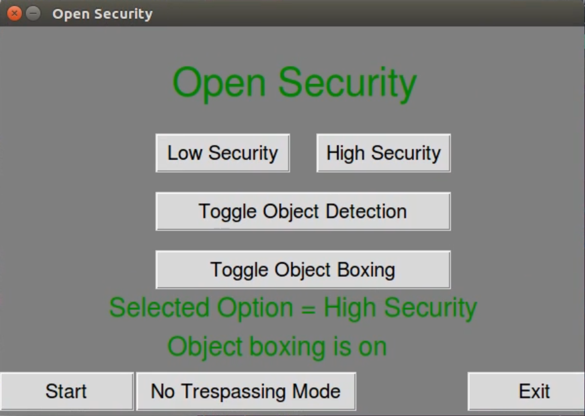

# Open Security
Open Security is a Python program that uses haar cascades to continuously 
scan for dangerous weapons such as guns and knives via webcam. If weapons are 
detected, Open Security is able to take a picture and send a tweet to alert
the user of the potential threat.

Devpost: https://devpost.com/software/open-security

## Built with:
- [OpenCV](https://opencv.org/)
- [Tweepy](https://www.tweepy.org/)
- [Pygame](https://www.pygame.org/)

## Demo

